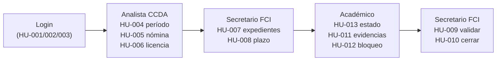

# Sprint Review — Demo Sprints 1 a 3

Guion oficial de la Sprint Review del proyecto **Sistema APA UCM**.
Cubre las 13 historias de usuario (HU-001 → HU-013) entregadas en los Sprints 1, 2 y 3.

---

## Índice

1. [Resumen ejecutivo](#1-resumen-ejecutivo)
2. [Preparación del entorno](#2-preparación-del-entorno)
3. [Credenciales](#3-credenciales)
4. [Mapeo HU → pantalla](#4-mapeo-hu--pantalla)
5. [Guion paso a paso](#5-guion-paso-a-paso)
6. [Flujo end-to-end](#6-flujo-end-to-end)
7. [Plan B](#7-plan-b)
8. [Próximos sprints](#8-próximos-sprints)

---

## 1. Resumen ejecutivo

- **Producto:** Sistema de Gestión del Proceso de Calificación Académica (APA UCM).
- **Sprints demostrados:** Sprint 1 (Auth + Roles), Sprint 2 (Calendarización + Inicio Secretario), Sprint 3 (Cierre Secretario + Evidencias).
- **Historias de usuario:** 13 HU cerradas (HU-001 → HU-013).
- **Stack:** Laravel 11 · React 18 + Inertia.js · PostgreSQL 16 · Redis 7 · Docker.
- **Estado:** Funcional end-to-end para el flujo Auth → Período → Nómina → Plazo → Evidencias → Validación → Cierre.
- **Datos de demo:** Pre-cargados por `DemoSeeder` (idempotente; regenera evidencias dummy en cada corrida).

La demo se ejecuta sobre un entorno Docker Compose local y sigue un único flujo end-to-end con 4 roles distintos.

---

## 2. Preparación del entorno

Desde la raíz del repositorio:

```bash
# 1) Levantar contenedores
docker compose up -d

# 2) Reset completo + datos de demo
docker compose exec app php artisan migrate:fresh --seed

# 3) Asegurar enlace de storage público (sólo primera vez)
docker compose exec app php artisan storage:link
```

La aplicación queda disponible en **http://localhost:8080**.

> Si algo se desordena durante la demo, basta con repetir el paso 2 para volver al estado inicial limpio (~10 s).

---

## 3. Credenciales

Todos los usuarios usan la contraseña `password`.

### Usuarios base

| Rol            | Email                 | Facultad | Uso en la demo                                     |
| -------------- | --------------------- | -------- | -------------------------------------------------- |
| Admin          | `admin@ucm.cl`        | —        | Mencionar como rol existente (no se usa).          |
| Analista CCDA  | `analista@ucm.cl`     | —        | Crear período, cargar nómina, marcar caso especial.|
| Secretario     | `secretario@ucm.cl`   | FCI      | Configurar plazo, validar y cerrar recepción.      |
| Miembro CCA    | `cca@ucm.cl`          | FCI      | Mencionar (funcionalidad de Sprint 4).             |
| Jefe Académico | `jefe@ucm.cl`         | FCI      | Mencionar (funcionalidad de Sprint 5).             |
| Académico      | `academico@ucm.cl`    | FCI      | Ver estado, subir evidencias, comprobar bloqueo.   |

### Académicos FCI extra (creados por `DemoSeeder`)

| Nombre                       | Email                  | Estado inicial de la nómina    |
| ---------------------------- | ---------------------- | ------------------------------ |
| Académico Prueba             | `academico@ucm.cl`     | `en_carga` (2 evidencias)      |
| María Elena Soto Ríos        | `maria.soto@ucm.cl`    | `pendiente` con licencia médica|
| Juan Carlos Pérez Muñoz      | `juan.perez@ucm.cl`    | `pendiente`                    |
| Andrea Fernanda Lagos Díaz   | `andrea.lagos@ucm.cl`  | `pendiente`                    |
| Roberto Esteban Vidal Bravo  | `roberto.vidal@ucm.cl` | `pendiente`                    |
| Camila Paz Núñez Sandoval    | `camila.nunez@ucm.cl`  | `pendiente`                    |

---

## 4. Mapeo HU → pantalla

| HU     | Descripción                          | Rol           | Pantalla / componente                                                   |
| ------ | ------------------------------------ | ------------- | ----------------------------------------------------------------------- |
| HU-001 | Login institucional                  | Todos         | `GET /login` — `Pages/Auth/Login.jsx`                                   |
| HU-002 | RBAC (control por rol)               | Todos         | Middleware `role:` en `routes/web.php`                                  |
| HU-003 | Logout                               | Todos         | Botón "Cerrar sesión" en `AppLayout`                                    |
| HU-004 | Crear período + cronograma           | Analista CCDA | `GET /analista/periodos/crear` — `Pages/Periodo/Create.jsx`             |
| HU-005 | Carga de nómina                      | Analista CCDA | `GET /analista/periodos/{id}/nominas/crear` — `Pages/Nomina/Create.jsx` |
| HU-006 | Caso especial / licencia médica      | Analista CCDA | Modal "Caso especial" en `Pages/Nomina/Create.jsx`                      |
| HU-007 | Vista centralizada de expedientes    | Secretario    | `GET /secretario/expedientes` — `Pages/Secretario/Expedientes.jsx`      |
| HU-008 | Configurar plazo por facultad        | Secretario    | Panel "Plazo de entrega" en `Pages/Secretario/Expedientes.jsx`          |
| HU-009 | Validación de documentación          | Secretario    | `Pages/Secretario/ExpedienteDetalle.jsx`                                |
| HU-010 | Cierre formal de recepción           | Secretario    | Botón "Cerrar recepción" en `Pages/Secretario/Expedientes.jsx`          |
| HU-011 | Carga de archivos por categoría APA  | Académico     | `GET /academico/evidencias` — `Pages/Academico/Evidencias.jsx`          |
| HU-012 | Bloqueo automático al vencer plazo   | Académico     | Flag `puedeCargar` en `EvidenciaController`                             |
| HU-013 | Visualización de estado propio       | Académico     | `GET /academico/dashboard` — `Pages/Dashboard/Academico.jsx`            |

---

## 5. Guion paso a paso

**Duración estimada:** 12 a 15 minutos.
Cada paso indica: usuario, ruta, acción a ejecutar, resultado esperado y HU validada.

### Bloque A — Autenticación y roles

> HU cubiertas: **HU-001, HU-002, HU-003**

**A.1 — Pantalla de login**
- **Usuario:** (sin sesión)
- **Ruta:** `/login`
- **Acción:** Mostrar el formulario institucional.
- **Resultado esperado:** Pantalla de login con campos email/password y branding UCM.
- **HU:** HU-001

**A.2 — Login del Analista**
- **Usuario:** `analista@ucm.cl`
- **Ruta:** `/login`
- **Acción:** Loguearse con la contraseña `password`.
- **Resultado esperado:** Redirección a `/analista/dashboard` con 3 KPIs (períodos activos, nóminas, cronogramas vigentes).
- **HU:** HU-001

**A.3 — Intento de acceso cruzado**
- **Usuario:** `analista@ucm.cl` (sesión iniciada)
- **Ruta:** `/secretario/expedientes`
- **Acción:** Pegar la URL en el navegador.
- **Resultado esperado:** Respuesta **403 Forbidden** (middleware `role:secretario` bloquea al analista).
- **HU:** HU-002

**A.4 — Logout**
- **Usuario:** `analista@ucm.cl`
- **Ruta:** Cualquier pantalla autenticada.
- **Acción:** Clic en "Cerrar sesión" (header del `AppLayout`).
- **Resultado esperado:** Sesión invalidada y redirección a `/login`.
- **HU:** HU-003

### Bloque B — Analista CCDA: período, nómina y licencia

> HU cubiertas: **HU-004, HU-005, HU-006**
>
> **Punto de partida:** El `DemoSeeder` ya creó un período activo con 6 nóminas FCI.
> El paso B.1 muestra la **pantalla de creación** (HU-004) sin necesariamente persistir un período nuevo.

**B.1 — Crear período (formulario)**
- **Usuario:** `analista@ucm.cl`
- **Ruta:** `/analista/periodos/crear`
- **Acción:** Mostrar el formulario de período + cronograma (6 etapas).
- **Resultado esperado:** Formulario completo con validaciones de fechas secuenciales dentro del período.
- **HU:** HU-004

**B.2 — Listado de períodos**
- **Usuario:** `analista@ucm.cl`
- **Ruta:** `/analista/periodos`
- **Acción:** Mostrar el listado de períodos.
- **Resultado esperado:** Tabla con el período `"{año}-1 - Calificación APA …"` en estado **activo**.
- **HU:** HU-004

**B.3 — Vista de nómina existente**
- **Usuario:** `analista@ucm.cl`
- **Ruta:** `/analista/periodos/{id}/nominas/crear`
- **Acción:** Abrir desde el botón "Cargar nómina" del período activo.
- **Resultado esperado:** Lista con los 6 académicos FCI pre-cargados, marcados como "en nómina".
- **HU:** HU-005

**B.4 — Caso especial (licencia médica)**
- **Usuario:** `analista@ucm.cl`
- **Ruta:** misma vista que B.3
- **Acción:** Localizar a **María Elena Soto Ríos**, abrir el modal "Caso especial", mostrar la observación pre-cargada y togglear off/on.
- **Resultado esperado:** El flag `con_licencia` se actualiza en vivo y aparece un badge "Caso especial" junto al académico.
- **HU:** HU-006

### Bloque C — Secretario FCI: expedientes y plazos

> HU cubiertas: **HU-007, HU-008**

**C.1 — Vista centralizada de expedientes**
- **Usuario:** `secretario@ucm.cl`
- **Ruta:** `/secretario/expedientes`
- **Acción:** Mostrar los 6 expedientes FCI, badges de estado, buscador y filtros.
- **Resultado esperado:** Tabla con 4 "Pendiente", 1 "En revisión" y 1 "Pendiente" con badge "Caso especial".
- **HU:** HU-007

**C.2 — Configurar plazo de entrega**
- **Usuario:** `secretario@ucm.cl`
- **Ruta:** `/secretario/expedientes`
- **Acción:** En el panel "Plazo de entrega", clic en "Editar plazo", elegir una fecha (ej. hoy + 15 días) y guardar.
- **Resultado esperado:** Mensaje de éxito + fecha límite actualizada. El plazo queda marcado como "Vigente".
- **HU:** HU-008

### Bloque D — Académico: estado y carga de evidencias

> HU cubiertas: **HU-013, HU-011, HU-012**

**D.1 — Dashboard del académico**
- **Usuario:** `academico@ucm.cl`
- **Ruta:** `/academico/dashboard`
- **Acción:** Mostrar el resumen del académico logueado.
- **Resultado esperado:** KPIs visibles — período activo, **2 evidencias cargadas**, estado **en_carga**.
- **HU:** HU-013

**D.2 — Carga de evidencias por categoría APA**
- **Usuario:** `academico@ucm.cl`
- **Ruta:** `/academico/evidencias`
- **Acción:** Mostrar las 5 categorías APA con las 2 evidencias pre-cargadas (Docencia + Investigación).
- **Resultado esperado:** Listado por categoría con archivos descargables y formulario de carga activo.
- **HU:** HU-011

**D.3 — Subida de evidencia en vivo (opcional)**
- **Usuario:** `academico@ucm.cl`
- **Ruta:** `/academico/evidencias`
- **Acción:** Subir un PDF real en "Vinculación con el Medio" con una breve descripción.
- **Resultado esperado:** Toast de éxito; el archivo aparece en su categoría con tamaño y fecha.
- **HU:** HU-011

**D.4 — Bloqueo por plazo vencido**
- **Usuario:** `secretario@ucm.cl` → `academico@ucm.cl`
- **Ruta:** `/secretario/expedientes` → `/academico/evidencias`
- **Acción:** Como Secretario, editar el plazo a la fecha de **ayer**; volver a la vista del Académico y refrescar.
- **Resultado esperado:** En `/academico/evidencias`, el formulario de carga se oculta y se muestra la alerta "El plazo de carga de evidencias ha vencido" (`puedeCargar=false`).
- **HU:** HU-012

> **Plan B (sin pasar por la UI):** `UPDATE plazos_facultad SET fecha_limite = '2020-01-01';` y refrescar. Recordar revertir con `migrate:fresh --seed` antes de continuar.

### Bloque E — Secretario FCI: validar y cerrar

> HU cubiertas: **HU-009, HU-010**
>
> **Antes de empezar:** restaurar el plazo a una fecha futura (o `migrate:fresh --seed`) para que la validación tenga sentido.

**E.1 — Validar expediente**
- **Usuario:** `secretario@ucm.cl`
- **Ruta:** `/secretario/expedientes` → clic en "Ver" del expediente **Académico Prueba**.
- **Acción:** Abrir el detalle del expediente.
- **Resultado esperado:** Vista con las 2 evidencias agrupadas por categoría, datos del académico y formulario de validación.
- **HU:** HU-009

**E.2 — Marcar como completo**
- **Usuario:** `secretario@ucm.cl`
- **Ruta:** `/secretario/expedientes/{nomina}`
- **Acción:** Acción **"Marcar como completo"**.
- **Resultado esperado:** El expediente pasa a estado **carga_cerrada** y se muestra mensaje de éxito.
- **HU:** HU-009

**E.3 — Cierre formal de recepción**
- **Usuario:** `secretario@ucm.cl`
- **Ruta:** `/secretario/expedientes`
- **Acción:** Clic en **"Cerrar recepción"** y confirmar el modal.
- **Resultado esperado:** Todos los expedientes en `pendiente`/`en_carga` pasan a `carga_cerrada`. El plazo queda marcado como **cerrado formalmente** con fecha/hora.
- **HU:** HU-010

**E.4 — Efecto en cascada en el académico**
- **Usuario:** `academico@ucm.cl`
- **Ruta:** `/academico/evidencias`
- **Acción:** Refrescar para evidenciar el efecto del cierre.
- **Resultado esperado:** El formulario de carga ya no aparece; la alerta indica que la recepción fue cerrada formalmente.
- **HU:** HU-010 + HU-012

---

## 6. Flujo end-to-end



---

## 7. Plan B

| Síntoma                                         | Solución rápida                                                                                |
| ----------------------------------------------- | ---------------------------------------------------------------------------------------------- |
| La BD se ensucia con datos creados en vivo      | `docker compose exec app php artisan migrate:fresh --seed` (~10 s, vuelve al estado limpio).   |
| El archivo recién subido no aparece             | Refrescar (`F5`). Si persiste, re-ejecutar `php artisan storage:link`.                         |
| El navegador no responde                        | `docker compose restart nginx app` y reintentar.                                               |
| Sólo se ve `academico@ucm.cl` en expedientes    | Re-correr `php artisan db:seed --class=DemoSeeder` (es idempotente).                           |
| El plazo no aparece como vencido                | Editarlo desde `/secretario/expedientes` con fecha de ayer (no requiere SQL).                  |
| Falla la subida de archivo                      | Verificar que sea PDF/DOC/DOCX/JPG/PNG y ≤ 10 MB (validación en `EvidenciaController@store`).  |
| El Vite dev server no levanta assets            | `docker compose restart vite` o, en su defecto, `docker compose exec app npm run build`.       |

---

## 8. Próximos sprints

Sprints planificados pero **fuera de alcance** de esta review:

- **Sprint 4 — Evaluación CCA + Calificación final (HU-014 → HU-020):** panel de evaluador, asignación de puntajes por categoría, cálculo de promedio y registro de calificación final.
- **Sprint 5 — Apelaciones, Jefatura y Cierre Institucional (HU-021 → HU-026):** ventana controlada de re-subida de evidencias, calificación de jefatura, generación de actas y cierre formal del proceso por año académico.

> La arquitectura (modelos, tablas, roles `miembro_cca` y `jefe_academico`, estados `en_evaluacion`/`evaluado`/`apelado`/`cerrado` de la nómina) ya está preparada para soportar ambos sprints sin migraciones disruptivas.
